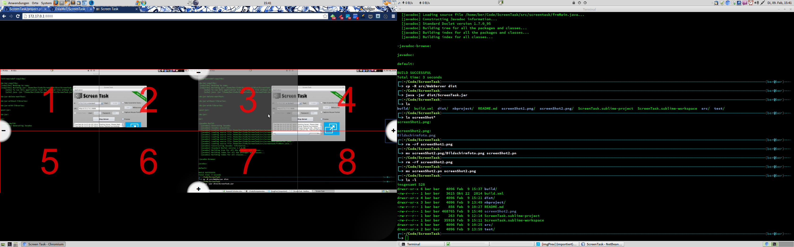
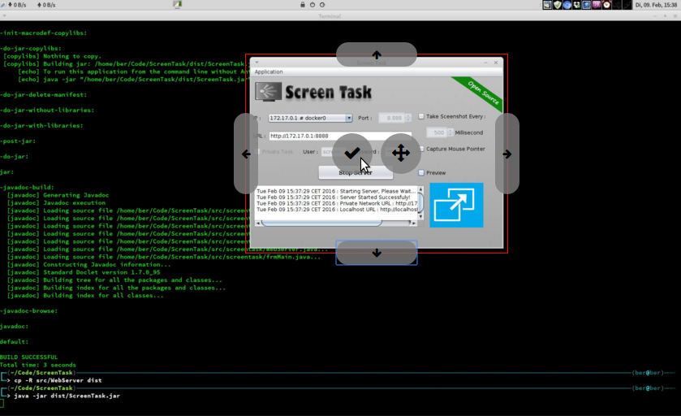

ScreenTask
==========

About
-----

This Programm consists of a Java App that regularly takes screenshots and a webserver that shows the newest screenshot.

History
-------

* The (Java App)[https://github.com/ahmadomar/ScreenTask] was developed by (ahmadomar)[https://github.com/ahmadomar] (discontinued).
* The predecessor is a (C# App)[https://github.com/EslaMx7/ScreenTask] by (Eslam Hamouda)[https://github.com/EslaMx7] (only bug fixes).
* (I)[https://github.com/HoffmannP] only updated the WebUI that refreshes the screenshots.

Features
--------
* Share your screen inside a network without internet connection (no TeamViewer anymore)
* WebUI so clients don't need any additional software (only a web browser)
* Make your session private using basic authentication (user/password)
* Works on Windows, Linux and Mac

Screenshots
-----------

* You can select to only view a selection of the full screen
* Update the refresh cycle independent from the server (shouldn't be greater thant the servers)

* Only show a tiled screen, you could use multiple monitors/browsers/what-evers or only select one part of the screen